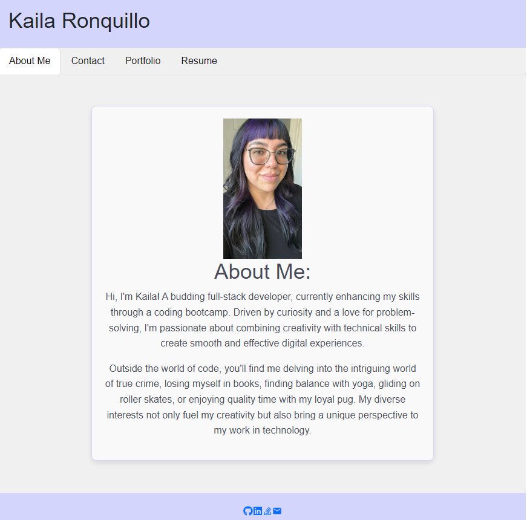

# Kaila's Portfolio

Welcome to my digital showcase! This is a single-page application portfolio designed to highlight my journey and accomplishments as a student web developer! Built with modern technologies, this site serves as both an introduction to my professional background and a technical demonstration of my skills.

- At the top of the page, you'll find my name along with a sleek navigation menu that adapts to any screen size. It'll guide you through my About Me, Portfolio, Contact, and Resume sections. The menu highlights whichever section you're currently exploring.

- As you click through the menu, each section appears below. The URL updates for each section.

- Explore a gallery of my projects, each represented with an image and links to both the live application and its source code on GitHub.

- Want to get in touch? I've set up a user-friendly contact form that makes reaching out easy!

- Click over to my resume section where you'll discover an overview of my technical skills and expertise.

- Down in the footer, I've placed handy links to my GitHub, LinkedIn, Stack Overflow, and email. It's like a digital business card - pick your preferred way to connect!

## Installation

To install Kaila's Portfolio:

- Clone the repository: `https://github.com/girlnotfound/Kaila-Portfolio`

- Navigate to the project directory

- Open the terminal and install the dependencies by running the command: `npm install`

- Run the seed script, in the terminal run: `npm run seed`

## Usage

- Start the application, in the terminal run the command: `npm start`

- You will be redirected to the application: `http://localhost:3000/`

[Link to Deployed Portfolio](https://kaila-portfolio.netlify.app/)

## Credits

This project was made possible with the help of:

[Adam Rosenberg](https://github.com/AcoderRose)

[Ryan Petersen](https://github.com/RyanPetersen-89)
